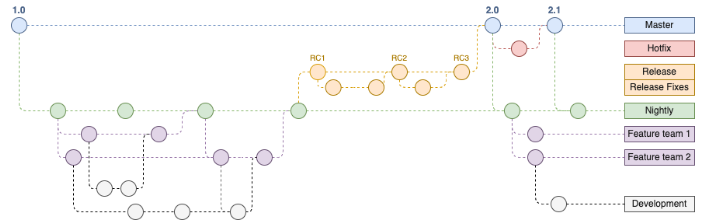

# Requirement Analysis in Software Development

This repository is dedicated to exploring the critical phase of **requirement analysis** in software development. It includes documentation, examples, and insights into how gathering, analyzing, and managing requirements can ensure the successful delivery of software projects. The content is intended for students, developers, and project managers looking to strengthen their understanding of this foundational step in the software development lifecycle.

# Requirement Analysis in Software Development

This repository is dedicated to exploring the critical phase of **requirement analysis** in software development. It includes documentation, examples, and insights into how gathering, analyzing, and managing requirements can ensure the successful delivery of software projects. The content is intended for students, developers, and project managers looking to strengthen their understanding of this foundational step in the software development lifecycle.

---

## What is Requirement Analysis?

**Requirement Analysis** is the process of identifying, gathering, and documenting the functional and non-functional needs of a software system. It acts as the foundation of the software development lifecycle (SDLC) by ensuring that the final product meets the expectations of its stakeholders.

During this phase, communication between stakeholders—such as clients, users, business analysts, and developers—is critical. The goal is to understand *what* the system should do and *why* it is needed before any design or development begins.

### Key Activities in Requirement Analysis:
- **Elicitation**: Collecting requirements through interviews, surveys, observations, and document analysis.
- **Analysis**: Evaluating requirements for feasibility, consistency, completeness, and clarity.
- **Specification**: Documenting requirements in formats like Software Requirements Specification (SRS).
- **Validation**: Ensuring the requirements accurately reflect stakeholder needs and can be implemented effectively.

### Importance in the SDLC:
1. ✅ **Clarity and Alignment**: Establishes a clear understanding between stakeholders and the development team.
2. ✅ **Reduced Rework**: Helps prevent misunderstandings and scope creep, saving time and cost during later phases.
3. ✅ **Improved Quality**: Accurate requirements lead to better-designed systems that fulfill user needs.
4. ✅ **Better Planning**: Enables accurate project estimation in terms of time, cost, and resources.
5. ✅ **Risk Reduction**: Identifies potential challenges and constraints early in the project.

## Why is Requirement Analysis Important?

Requirement Analysis plays a crucial role in the success of any software development project. It serves as the backbone for designing, developing, and delivering a product that meets user expectations and business goals. Below are three key reasons why it is critical in the Software Development Life Cycle (SDLC):

### 1. Prevents Miscommunication and Misunderstanding
Clear and well-documented requirements ensure that all stakeholders—including clients, developers, and testers—are aligned in their understanding of the project goals. This helps avoid ambiguity and reduces the chances of building the wrong product.

### 2. Saves Time and Cost
Identifying the right requirements early in the project helps minimize costly changes later in the development process. A thorough analysis reduces rework, shortens development time, and avoids budget overruns caused by late discoveries of missing or incorrect features.

### 3. Improves Product Quality
By thoroughly understanding the needs of users and stakeholders, developers can build solutions that are more effective and user-friendly. Requirement analysis ensures that the final product delivers real value, meets expectations, and satisfies the conditions for success.

---

## Key Activities in Requirement Analysis

Requirement Analysis involves several critical activities that help ensure the software solution aligns with business needs and user expectations. Below are the five key activities involved in this process:

- **Requirement Gathering**  
  This is the initial step where information about the desired system is collected from various stakeholders, including clients, end-users, business managers, and developers. It aims to understand the high-level goals and expectations for the project.

- **Requirement Elicitation**  
  This involves using techniques such as interviews, questionnaires, workshops, brainstorming sessions, and observation to dig deeper into stakeholders' needs. The goal is to uncover explicit and implicit requirements that may not be immediately obvious.

- **Requirement Documentation**  
  After gathering and eliciting requirements, they must be clearly documented in a structured format—typically in a Software Requirements Specification (SRS) document. This ensures all stakeholders have a reference point and helps guide the development process.

- **Requirement Analysis and Modeling**  
  During this phase, the documented requirements are analyzed for clarity, completeness, feasibility, and consistency. Techniques such as use case diagrams, data flow diagrams (DFDs), and entity-relationship diagrams (ERDs) may be used to model and visualize requirements.

- **Requirement Validation**  
  This step ensures that the documented requirements accurately represent what stakeholders want and are technically feasible. Validation is done through reviews, inspections, walkthroughs, or prototyping, and helps catch issues early before development begins.

## Types of Requirements

In software development, requirements are generally classified into **Functional Requirements** and **Non-functional Requirements**. Both types are essential to deliver a successful system.

### Functional Requirements

Functional requirements describe the specific behaviors or functions the system must perform. They define what the system **should do**.

**Examples for a Booking Management Project:**
- Users must be able to create, update, and cancel bookings.
- The system should allow users to search available slots based on date and time.
- Admins can approve or reject booking requests.
- Notifications must be sent to users upon booking confirmation or cancellation.
- Users should be able to view their booking history.

### Non-functional Requirements

Non-functional requirements specify the quality attributes, system performance, and constraints that affect how the system operates. They define **how the system should be**.

**Examples for a Booking Management Project:**
- The system must handle at least 1000 simultaneous users without performance degradation.
- Booking confirmation notifications should be sent within 5 seconds.
- The application must be available 99.9% of the time (high availability).
- User data must be securely stored and comply with data protection regulations.
- The system should have a user-friendly interface accessible on both desktop and mobile devices.

## Use Case Diagrams

Use Case Diagrams are visual representations that illustrate the interactions between users (actors) and the system to achieve specific goals. They depict the functional requirements of a system by showing various use cases—scenarios in which users interact with the system—and the actors involved.

### Benefits of Use Case Diagrams:
- **Clarify Requirements**: They provide a clear and simple way to understand what the system should do from the user's perspective.
- **Improve Communication**: Help bridge the gap between technical teams and non-technical stakeholders by presenting requirements visually.
- **Identify Actors and Roles**: Highlight different user roles and their interactions with the system.
- **Guide Development and Testing**: Serve as a foundation for system design, development, and test case creation.
- **Scope Definition**: Help define system boundaries and focus on essential functionalities.

Use Case Diagrams are widely used during the requirement analysis phase to ensure all parties have a shared understanding of the system’s behavior and user interactions.

